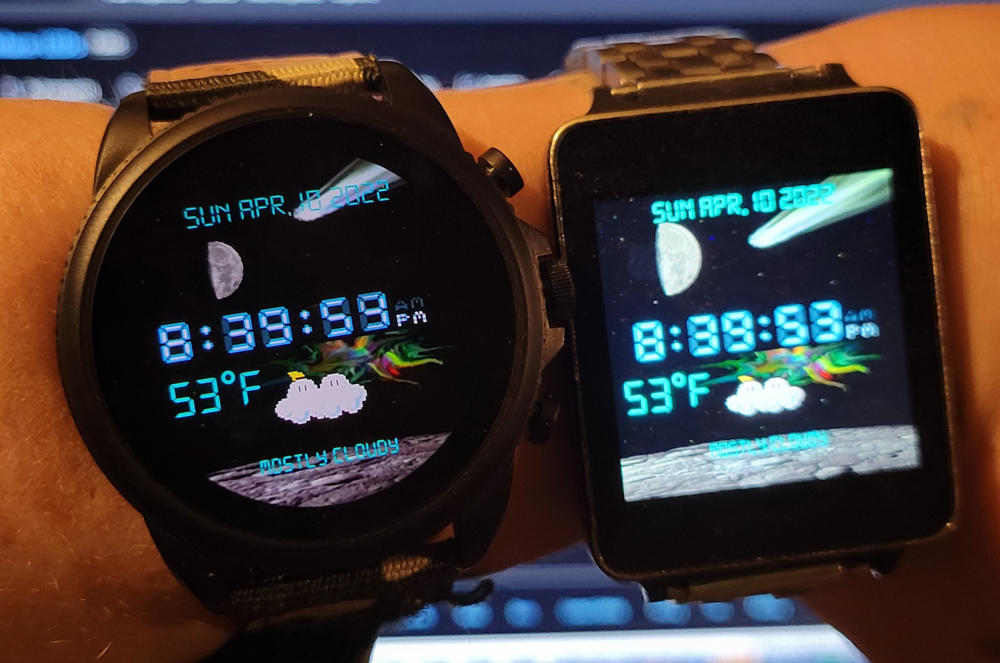
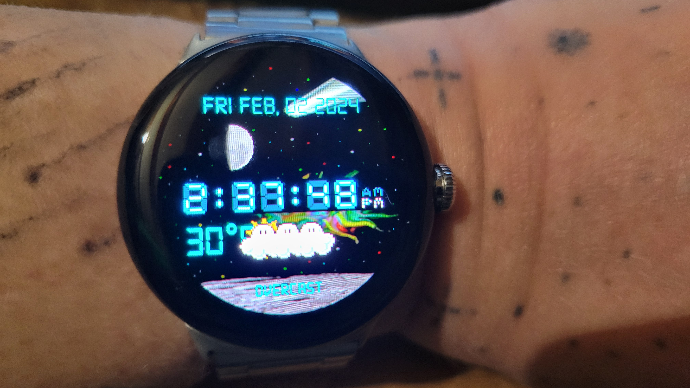

# Own-watchface-LEDs WatchFaceFormat      

This watchface will work on WearOS 5 and newer Pixel Watches and Galaxy Watch 7     
This watchface will work on WearOS 4 versions.  I tested this watchface on my Pixel Watch 2 and it is working on it too.  

# NOTE 
My old Kotlin watchface will not work on WearOS 5 because Google is forcing WatchFaceFormat.   
FUCK YOU TO GOOGLE!!!!   I prefer and needed to use code in kotlin for my favorite watchface.        
It will not work on my pixel watch 3.  I am glad I do not spent $400 for this trash pixel watch 3   
your new Pixel watches are not worthy $300!!! I hate coding limits!!!!  FUCK YOU TO GOOGLE!!!!     
I got my 45mm version for like $100!!!     

This have been my watchface for many years for my smart watches on Android Wear and Wear OS.
This watch face do not need phone to be connected and sending datas. 
This watch face require newer version of Wear OS. Tested on Google Pixel watch too.     

